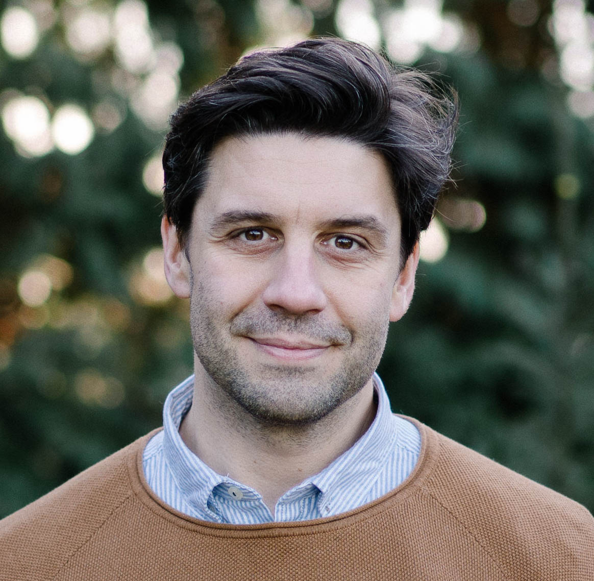

<!-- Hero -->

<strong>
Asst. Professor at <a href="http://www.tudelft.nl/">TU Delft</a> and Amazon Scholar (<a href="https://www.amazon.science/research-areas/information-and-knowledge-management">AWS</a>).</strong>

I am the Chair of the <a href="https://dis.ewi.tudelft.nl">Data-intensive Systems Group</a>. I work in the broad area of scalable data management; at the moment most of my research focuses on Cloud application runtimes, distributed transactions, and data integration. My research has found applications in multiple real-world systems, including Apache Flink, and different systems within AWS cloud. I received my PhD from <a href="http://www.inria.fr/saclay/">INRIA Saclay</a> &amp; <a href="http://www.u-psud.fr">Université Paris-Sud</a> in 2013, supervised by <a href="http://www-rocq.inria.fr/~manolesc/">Ioana Manolescu</a>. Before joining TU Delft in 2017 I held positions at the <a href="http://www.dima.tu-berlin.de/menue/database_systems_and_information_management_group/?no_cache=1">database systems group</a> at TU Berlin, working with <a href="https://www.dima.tu-berlin.de/menue/staff/volker_markl/">Volker Markl</a>, and the <a href="https://icn.sap.com">SAP Innovation Center</a> in Berlin. I my BSc and MSc at the University of Cyprus, working with <a href="http://www.cs.ucy.ac.cy/~mdd/">Marios Dikaiakos</a>.

<strong> Awards</strong> 

ACM SIGMOD Systems Award 2023
NWO VIDI Grant 2022
ACM DEBS Best Paper 2021
EDBT Best Paper 2019
EDBT Best Demo 2023
ACM SIGMOD Research Highlights Award 2015

  
  

  

    

      
      <a href="mailto:A.Katsifodimos@tudelft.nl">A.Katsifodimos@tudelft.nl</a>
    

    

      
      Room 1E100, Van Mourik Broekmanweg 6 2628XE Delft, Netherlands
    

  

  

  

    <a href="https://scholar.google.com/citations?user=1KdkcSoAAAAJ&hl=en&oi=ao"> Scholar</a>
    <a href="https://www.linkedin.com/in/asteriosk/"> LinkedIn</a>
    <a href="https://github.com/asteriosk"> GitHub</a>
    <a href="https://x.com/kAsterios"> X</a>
  

<!-- Research Areas -->

<h5>Research Areas</h5>

  

  <h6>Cloud Runtimes</h6>
  
Building programming models and runtimes that bring ACID transactions to stateful serverless in the Cloud.

  

  <h6>Stream Processing</h6>
  
Designing fault-tolerant, high-throughput streaming systems that scale to billions of events per second.

  

  <h6>Data Discovery</h6>
  
Automating the discovery of datasets and their relationships in data lakes and enterprise repositories.

<!-- Career Timeline (hidden, to be placed elsewhere later)

<h2>Career</h2>

  

    
2025&ndash;

    

    

      
      <strong>Amazon Scholar</strong> &mdash; AWS
    

  

  

    
2024&ndash;

    

    

      
      <strong>Head of the DIS Group</strong> &mdash; TU Delft
      
Data-intensive Systems Group

    

  

  

    
2021–2024

    

    

      
      <strong>Amazon Visiting Academic</strong> &mdash; AWS
    

  

  

    
2017&ndash;

    

    

      
      <strong>Assistant Professor</strong> &mdash; TU Delft
      
Faculty of EEMCS &middot; Delft, Netherlands

    

  

  

    
2017

    

    

      
      <strong>Senior Software Engineer</strong> &mdash; SAP Innovation Center, Berlin
      
Scalable architectures for machine learning inference and training

    

  

  

    
2013–2017

    

    

      
      <strong>Postdoctoral Researcher</strong> &mdash; TU Berlin
      
Database Systems &amp; Information Management Group &middot; with Volker Markl

    

  

  

    
2009–2013

    

    

      
      <strong>PhD</strong> &mdash; INRIA Saclay &amp; Universit&eacute; Paris-Sud
      
Supervised by Ioana Manolescu

    

  

  

    
2003–2009

    

    

      
      <strong>BSc &amp; MSc</strong> &mdash; University of Cyprus
      
High Performance Computing Lab (HPCL) &middot; with Marios Dikaiakos

    

  

-->

